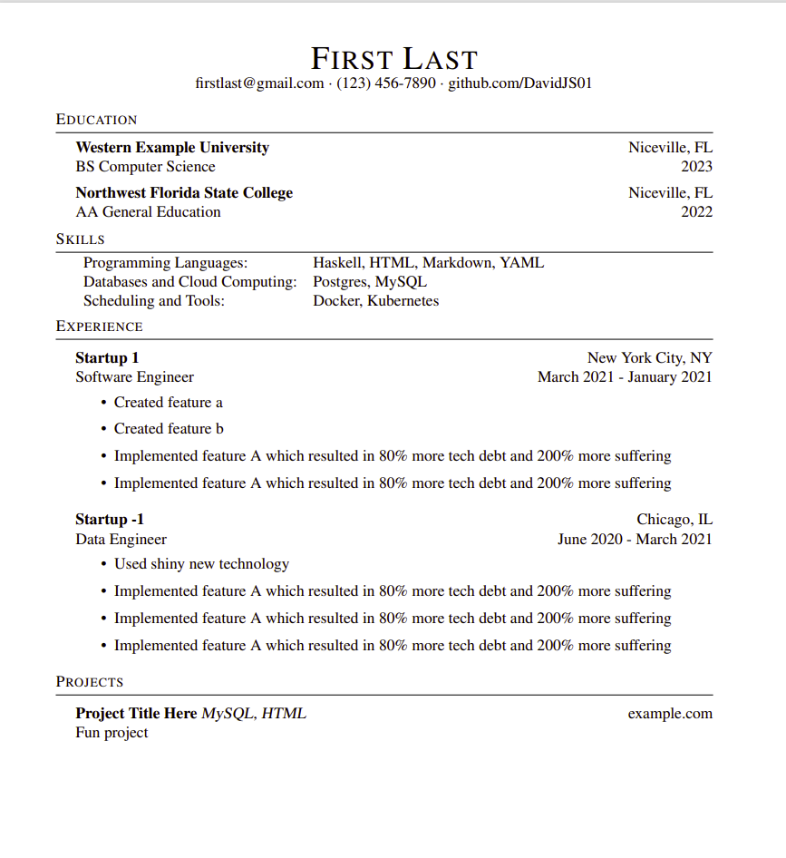

# Example Output


# David's Declarative Resume Builder
This is a somewhat hacky, messy, not-so-refined declarative resume builder that I created.

I wanted to manage my resumes in version control, and I took a template from latexresu.me and modified it a bit.

It was a little annoying modifying my resume in WYSIWG editors and I wanted to simply use a friendly format, so I created this.

This project will either read from an input.json file, or a yaml.json file, and output a latex file.

**This is not actively maintained. Features will not be added at request because this is just my personal workflow, published. If you use this tool and want to make it fit your use case that is not supported, fork and edit the project.**

## Requirements
1. Go 1.22 (you probably can use any version, just downgrade in `go.mod`)
2. OPTIONAL: `pdflatex` for the `--pdf` output flag

## Install Project
```sh
# clone project
git clone git@github.com:DavidJS01/ddrb.git

# go into project directory
cd ddrb

# install project
go install

```

# Usage
## Default Arguments
```sh
# calling ddrb itself defaults to looking for an input.yaml file at $pwd
ddrb
```

## With Filepath (YAML input)
```sh
# it will look for the file at the specified path
# it infers the file format given a path
ddrb --file_path ~/projects/resume_builder/input.yaml

```

# With Filepath (JSON input)
```sh
ddrb --file_path ~/projects/resume_builder/input.json
```

# Also Build PDF
```sh
# add the --pdf flag
ddrb --file_path ~/projects/resume_builder/input.yaml --pdf
```
